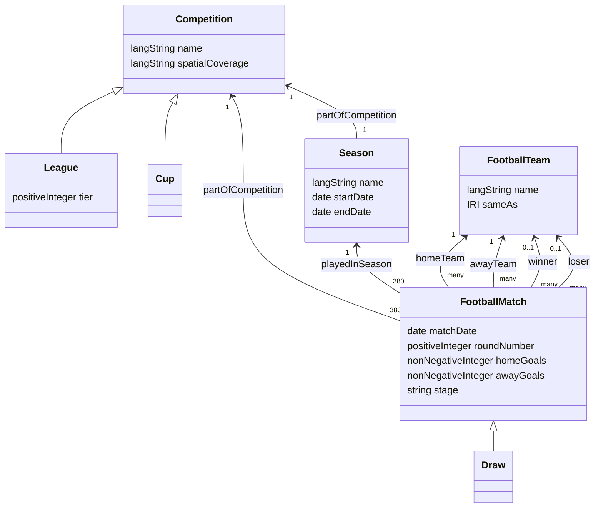

# Ontology overview

The ontology models the smallest useful Premier League domain supported by the
selected source data.

## Vocabulary reuse

- Schema.org supplies `SportsEvent`, `SportsTeam`, `Event`, `name`,
  `startDate`, `endDate`, `homeTeam`, and `awayTeam` semantics.
- Dublin Core supplies dataset metadata and `isPartOf` semantics.
- OWL supplies ontology declarations, functional properties, and `sameAs`.
- XSD supplies date and numeric datatypes.

Project-specific properties are used only for football facts that do not have
a sufficiently precise reused property, such as full-time home and away goals.

## Result semantics

The Premier League resource is both a `Competition` and a `League` with tier
1. Matches with equal scores are typed as `Draw`. Every other match has one
`winner` and one `loser`, both of which must be participating teams and must
agree with the full-time scores. SHACL validates these rules.

`Cup` and `stage` are defined so the vocabulary can grow without an ontology
redesign, but no cup instances or stage values are asserted in the current
league-only dataset.
