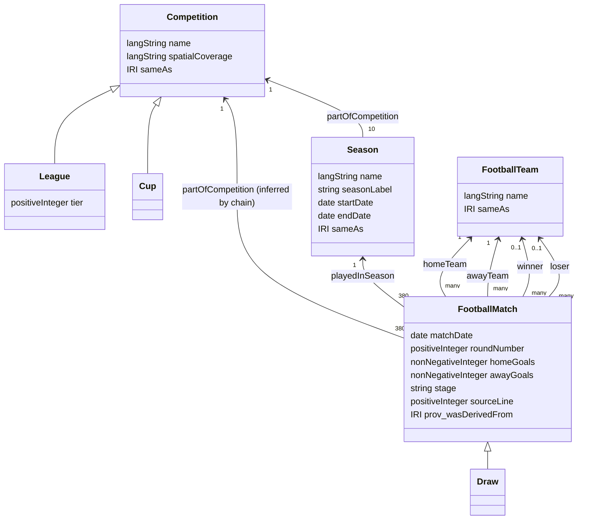

# Ontology overview

The ontology (`ontology/football.ttl`, namespace
`https://datdinh0923.github.io/SemanticWeb_2025B/ontology/`, prefix `foot:`)
models the football domain supported by the source data: competitions, their
seasons, the clubs, and full-time match results.

## Classes and alignment

| Class | Meaning | Aligned with |
| --- | --- | --- |
| `foot:Competition` | An ongoing competition held as a series of seasons | `schema:EventSeries` |
| `foot:League` / `foot:Cup` | Disjoint kinds of competition; a league has exactly one `tier` | `foot:Competition` |
| `foot:Season` | One time-bounded edition of a competition | `schema:SportsEvent` |
| `foot:FootballMatch` | One played match with a full-time score | `schema:SportsEvent` |
| `foot:Draw` | A match with equal scores and no winner or loser | `foot:FootballMatch` |
| `foot:FootballTeam` | A club whose identity persists across seasons | `schema:SportsTeam` |

## OWL axioms

Beyond the class hierarchy, the ontology states constraints a reasoner can
use and check:

- **Qualified cardinalities**: every match has exactly one home team, one away
  team (both `FootballTeam`), and one season.
- **Functional properties**: a match has at most one date, round, score per
  side, winner, and loser.
- **Disjointness**: `Competition`, `Season`, `FootballTeam`, and
  `FootballMatch` are pairwise disjoint (`owl:AllDisjointClasses`); `League` and
  `Cup` are disjoint; `homeTeam` and `awayTeam`, and `winner` and `loser`, are
  disjoint properties, so no team can play itself or both win and lose.
- **A draw has no result**: `Draw` is a subclass of the complement of
  `∃winner.Thing` and of `∃loser.Thing`.
- **Property hierarchy**: `homeTeam`, `awayTeam`, `winner`, and `loser` are
  sub-properties of `foot:participant`, itself a sub-property of
  `schema:competitor`. `playedInSeason` specializes `schema:superEvent` and
  `dcterms:isPartOf`.
- **Property chain**: `playedInSeason ∘ partOfCompetition ⊑ partOfCompetition`,
  so a reasoner infers each match's competition from its season.

`partOfCompetition` is deliberately not functional. OWL 2 DL forbids
functional properties that are defined by a property chain, so its single
value is enforced by SHACL instead. The generated data also asserts each
match's competition, so plain SPARQL works without a reasoner.

The external schema.org and Dublin Core terms are declared as OWL classes and
properties so that Protégé and OWL 2 reasoners type them correctly.

### Reasoning check

`src/check_reasoning.py` (`make reasoning`, part of `make pipeline` and CI)
computes the OWL 2 RL closure of the ontology and the full data with
[owlrl](https://github.com/RDFLib/OWL-RL). Before reasoning it removes the
3,800 asserted match competitions, so the property chain has to re-infer
them. It then runs the same plain SPARQL counts (no property paths) on the
graph without and with reasoning:

| Measure | Without | With OWL 2 RL |
| --- | ---: | ---: |
| Matches with a competition (property chain) | 0 | 3,800 |
| Local resources typed `schema:SportsEvent` (3,800 matches + 10 seasons) | 0 | 3,810 |
| Local resources typed `schema:SportsTeam` | 0 | 35 |
| Local resources typed `schema:EventSeries` | 0 | 1 |
| Matches with a `schema:competitor` | 0 | 3,800 |
| Matches `dcterms:isPartOf` a season | 0 | 3,800 |
| Wikidata URIs typed `foot:FootballTeam` (via `owl:sameAs`) | 0 | 35 |
| Matches whose home team is a Wikidata URI (via `owl:sameAs`) | 0 | 3,800 |
| Wikidata `owl:sameAs` DBpedia pairs (symmetry and transitivity) | 0 | 46 |

The closure grows the graph from 49,021 to 248,228 triples in about 40 s; most
of the growth is `owl:sameAs` copying every statement about a club, season or
the competition onto its Wikidata and DBpedia URIs. The graph is consistent.
The four schema.org counts equal those of CQ16, which emulates the same
subclass and sub-property entailment with property paths at query time.

The script then adds deliberate errors to one real match and reasons over the
ontology plus that match:

| Deliberate error | Result | Axiom that catches it |
| --- | --- | --- |
| A drawn match is given a winner | inconsistent | `Draw ⊑ ¬∃winner.⊤` |
| A team plays itself | inconsistent | `homeTeam` disjoint with `awayTeam` |
| The same team wins and loses | inconsistent | `winner` disjoint with `loser` |
| A match is also typed as a team | inconsistent | `AllDisjointClasses` |
| A match gets a second home team | **consistent** | — |

The last row shows the limit of OWL for data validation. Because `homeTeam`
is functional and OWL makes no unique-name assumption, the reasoner does not
reject the second home team; it concludes that the two clubs are the same
(`team:manchester-united owl:sameAs team:arsenal`). SHACL's `sh:maxCount 1`
rejects the same data, which is why both are used.

### Limitations of reasoning

- **The SPARQL endpoint serves asserted triples only.** Neither Fuseki nor
  `run_sparql.py` runs a reasoner, so every fact the queries rely on
  (`partOfCompetition` of a match, `winner`, `loser`, `Draw`) is asserted by
  the converter. Serving the closure would also add the `owl:sameAs` copies
  above to every query result. Jena's built-in OWL rule reasoners also do not
  cover OWL 2 property chains, so enabling one in Fuseki would not reproduce
  the chain inference.
- **`Draw`, `winner` and `loser` cannot be inferred.** OWL cannot compare two
  data values (`homeGoals = awayGoals`), so these are derived by the
  converter and checked against the scores by SHACL-SPARQL constraints.
- **OWL 2 RL is incomplete for this ontology.** The exact cardinalities, the
  existential restriction on `Season` and the union domain of
  `partOfCompetition` are outside the RL profile; owlrl's rules are sound but
  ignore them. The corresponding constraints are enforced by SHACL.
- SHACL validation (`validate_rdf.py`) itself runs with pySHACL's RDFS
  inference, so subclass typing is used when shapes are matched.

## Ontology metrics

Measured with [ROBOT](http://robot.obolibrary.org/) 1.9.6 (`robot measure
--metrics extended`, OWL API):

| Metric | Value |
| --- | ---: |
| Classes (own / reused schema.org / `owl:Thing`) | 11 (7 / 3 / 1) |
| Object properties (own / reused) | 12 (7 / 5) |
| Datatype properties (own / reused) | 9 (8 / 1) |
| Logical axioms (TBox / RBox) | 73 (59 / 14) |
| `SubClassOf` / `DisjointClasses` | 14 / 2 |
| `SubObjectPropertyOf` / `SubPropertyChainOf` / `DisjointObjectProperties` | 10 / 1 / 2 |
| Functional object / data properties | 5 / 8 |
| Domain / range axioms | 15 / 15 |
| All axioms, including declarations and annotations | 155 |
| DL expressivity | ALCRQ(D) |

The expressivity follows from the constructs OWL API reports: complex
negation, union and full existentials (ALC), complex role inclusions, i.e. the
property chain and disjoint properties (R), qualified cardinalities (Q) and
datatypes (D). There are no inverse properties, nominals or transitive
properties.

`robot validate-profile --profile DL` reports one violation: `xsd:date`, the
range of `matchDate`, is not in the OWL 2 datatype map. With `xsd:date`
replaced by `xsd:dateTime` in a scratch copy, the ontology is in OWL 2 DL.
It is not in OWL 2 EL, QL or RL.

### Note on dates

Dates use `xsd:date`, like schema.org, Wikidata, and DBpedia. `xsd:date` is
not in the OWL 2 datatype map, so strictly the ontology is OWL 2 Full, and
DL reasoners such as HermiT refuse it. To check the axioms with HermiT, map
`xsd:date` to `xsd:dateTime` in a scratch copy; owlrl, Protégé, Jena, rdflib,
and SHACL validation all handle `xsd:date` directly.

## Vocabulary reuse

- Schema.org supplies `SportsEvent`, `SportsTeam`, `EventSeries`, `name`,
  `startDate`, `endDate`, `homeTeam`, `awayTeam`, `competitor`, and
  `superEvent` semantics.
- Dublin Core supplies dataset metadata and `isPartOf` semantics.
- PROV-O records where every season and match came from
  (`prov:wasDerivedFrom` the source CSV file; `foot:sourceLine` the row).
- DCAT and VoID describe the dataset, its distribution, class partitions, and
  the Wikidata and DBpedia linksets.
- OWL supplies ontology declarations, axioms, and `owl:sameAs`.
- XSD supplies date and numeric datatypes.

Project-specific properties are used only for football facts without a
sufficiently precise reused property, such as full-time home and away goals.

## Result semantics

The Premier League resource is both a `Competition` and a `League` with tier
1. Matches with equal scores are typed as `Draw`. Every other match has one
`winner` and one `loser`, both participating teams that agree with the
full-time scores. SHACL validates these rules on the data.

`Cup` and `stage` are defined so the vocabulary can grow without a redesign,
but no cup instances or stage values exist in the current league-only data.
