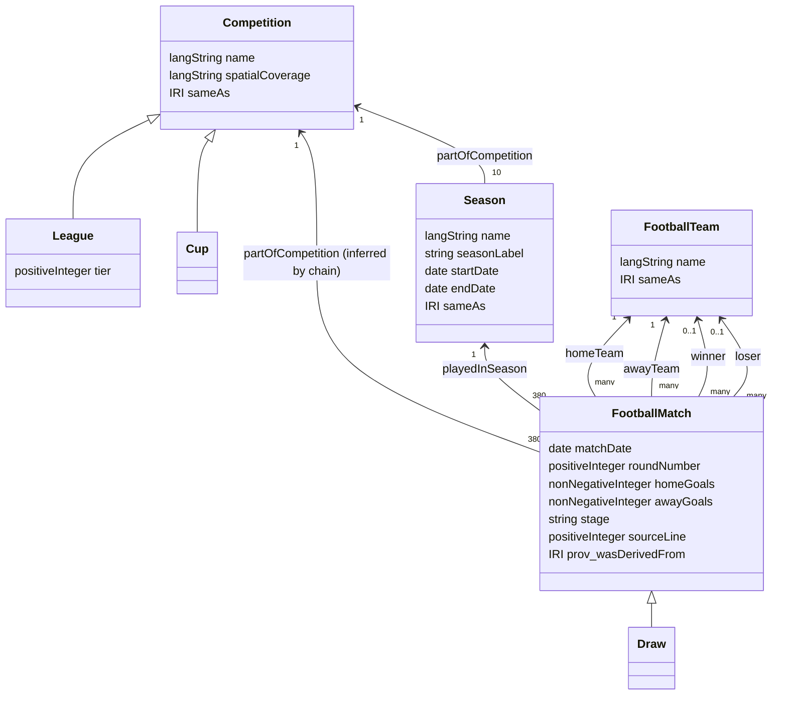

# Ontology overview

The ontology (`ontology/football.ttl`, namespace
`https://datdinh0923.github.io/SemanticWeb_2025B/ontology/`, prefix `foot:`)
models the football domain supported by the source data: competitions, their
seasons, the clubs, and full-time match results.

## Classes and alignment

| Class | Meaning | Aligned with |
| --- | --- | --- |
| `foot:Competition` | An ongoing competition held as a series of seasons | `schema:EventSeries` |
| `foot:League` / `foot:Cup` | Disjoint kinds of competition; a league has exactly one `tier` | `foot:Competition` |
| `foot:Season` | One time-bounded edition of a competition | `schema:SportsEvent` |
| `foot:FootballMatch` | One played match with a full-time score | `schema:SportsEvent` |
| `foot:Draw` | A match with equal scores and no winner or loser | `foot:FootballMatch` |
| `foot:FootballTeam` | A club whose identity persists across seasons | `schema:SportsTeam` |

## OWL axioms

Beyond the class hierarchy, the ontology states constraints a reasoner can
use and check:

- **Qualified cardinalities**: every match has exactly one home team, one away
  team (both `FootballTeam`), and one season.
- **Functional properties**: a match has at most one date, round, score per
  side, winner, and loser.
- **Disjointness**: `Competition`, `Season`, `FootballTeam`, and
  `FootballMatch` are pairwise disjoint (`owl:AllDisjointClasses`); `League` and
  `Cup` are disjoint; `homeTeam` and `awayTeam`, and `winner` and `loser`, are
  disjoint properties, so no team can play itself or both win and lose.
- **A draw has no result**: `Draw` is a subclass of the complement of
  `∃winner.Thing` and of `∃loser.Thing`.
- **Property hierarchy**: `homeTeam`, `awayTeam`, `winner`, and `loser` are
  sub-properties of `foot:participant`, itself a sub-property of
  `schema:competitor`. `playedInSeason` specializes `schema:superEvent` and
  `dcterms:isPartOf`.
- **Property chain**: `playedInSeason ∘ partOfCompetition ⊑ partOfCompetition`,
  so a reasoner infers each match's competition from its season.

`partOfCompetition` is deliberately not functional. OWL 2 DL forbids
functional properties that are defined by a property chain, so its single
value is enforced by SHACL instead. The generated data also asserts each
match's competition, so plain SPARQL works without a reasoner.

The external schema.org and Dublin Core terms are declared as OWL classes and
properties so that Protégé and OWL 2 reasoners type them correctly.

### Reasoner check

The axioms were checked with the HermiT reasoner (through owlready2) on the
ontology plus the complete 2018/19 season, with the asserted match
competitions removed:

- the ontology and data are consistent;
- the property chain infers the competition of all 380 matches;
- adding a winner to a draw, or making a team play itself, makes the
  ontology inconsistent, so the axioms catch those errors on their own.

### Note on dates

Dates use `xsd:date`, like schema.org, Wikidata, and DBpedia. `xsd:date` is
not in the OWL 2 datatype map, so the HermiT reasoner refuses it. To check the
axioms with HermiT, map `xsd:date` to `xsd:dateTime` in a scratch copy;
Protégé, Jena, rdflib, and SHACL validation all handle `xsd:date` directly.

## Vocabulary reuse

- Schema.org supplies `SportsEvent`, `SportsTeam`, `EventSeries`, `name`,
  `startDate`, `endDate`, `homeTeam`, `awayTeam`, `competitor`, and
  `superEvent` semantics.
- Dublin Core supplies dataset metadata and `isPartOf` semantics.
- PROV-O records where every season and match came from
  (`prov:wasDerivedFrom` the source CSV file; `foot:sourceLine` the row).
- DCAT and VoID describe the dataset, its distribution, class partitions, and
  the Wikidata and DBpedia linksets.
- OWL supplies ontology declarations, axioms, and `owl:sameAs`.
- XSD supplies date and numeric datatypes.

Project-specific properties are used only for football facts without a
sufficiently precise reused property, such as full-time home and away goals.

## Result semantics

The Premier League resource is both a `Competition` and a `League` with tier
1. Matches with equal scores are typed as `Draw`. Every other match has one
`winner` and one `loser`, both participating teams that agree with the
full-time scores. SHACL validates these rules on the data.

`Cup` and `stage` are defined so the vocabulary can grow without a redesign,
but no cup instances or stage values exist in the current league-only data.
